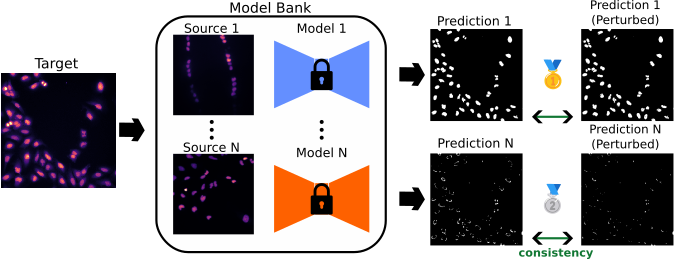

# CRank - Consistency based Ranking
### Ranking pre-trained segmentation models for zero-shot transferability 
([link to paper](https://arxiv.org/abs/2503.00450))




## Installation
#### Clone repository

Clone and navigate to this repository

```
git clone https://github.com/kreshuklab/CRank-Consistency_based_ranking.git
cd CRank-Consistency_based_ranking
```

#### Install model_ranking conda environment

```
conda env create -f environment.yaml
conda activate CRank
```

#### Download Pre-trained models

The model checkpoints and training configs are saved on zenodo and can be downloaded and unzipped https://doi.org/10.5281/zenodo.15211900


#### Download Data

Links to data locations or refeerences given below, data must be downloaded. The code provides pytorch Datasets for all of the considered datasets.


## Running Scripts

Within the scripts folder there are mulitple scripts that allow easy interaction with the repository and to reproduce the results of the paper.

All of the scripts require a single command line argument --config which defines a path to a `meta_config.yaml` that defines the arguments to be used in that particular script. The general structure of the code base is that the user defines a meta config which defines a transfer sweep between a set of source models and target datasets. When running the scripts they will automatically generate individual transfer yamls which define the arguments for one specfic transfer (Source model -> Target dataset). The results and corresponding transfer yamls will be saved in a specific structure as illustrated in `examples/example_batch_run/output_structure`.

The meta_config.yaml has a specific structure defined by the pydantic model `MetaConfig()`, which can be found in `src/model_ranking/dataclass.py`, and is summarised below. Examples of suitable meta configs can be found in `examples/meta_configs`.

**MetaConfig():**
- **target_datasets**: Sequence of target dataset configs defining the datasets which will be investigated in this run. In practice since TargetConfigs have predefined default values, we only need to specify the dataset names to run with default settings.
- **source_models**: Sequence of source models that will be used to predict on each of the target datasets, again can be specified just as a sequence of names.
- **segmentation_mode**: Specify if instance or semantic segmentation. Appropriate models should be used.
- **run_mode**: Specify if running full sweep with prediction, performance evaluation and consistency evaluation. Or if only performance evaluation or only conistency evaluation.
- **summary_results**: Define settings for saving summary results.
- **overwrite_yaml**: Boolean flag to overwrite any exisiting run config yamls.
- **data_base_path**: Path to data directory containing target datasets.
- **model_dir_path**: Path to directory containing source model checkpoints.
- **feature_perturbations**: Defining feature space perturbation settings, used for consistency calculation if required.
- **input_augs**: Defining input perturbation settings, used for consistency calculation if required.
- **output_settings**: Defining output settings.
- **eval_settings**: Defining performance evaluation metric settings, if required.
- **consistency_settings**: Defining consistency metric settings, if required.

#### Activate conda environment

```
conda activate CRank
```

#### Batch run prediciton and evaluation
To perform a batch of inference runs between a set of source models transferred to a set of target datasets and then calculate ground-truth performance metrics and consistency scores, specifiy a suitable "meta_config.yaml" file (example given meta_configs/) and run the script batch_prediction_evaluation.py. To run on GPU optionally specify a cuda device.

```
CUDA_VISIBLE_DEVICES=0 python batch_prediction_evaluation.py --config path/to/meta_config.yaml
```

#### Batch run only Evaluation/Consistency
To perform a batch of performance evaluations or consistency scores between a set of source models transferred to a set of target datasets, specify a suitable "meta_config.yaml" with "run_mode=evaluation or consistency" and then run the script "batch_evaluate.py" or "batch_consistency.py" respectively.

```
CUDA_VISIBLE_DEVICES=0 python batch_evaluate.py --config path/to/evaluation/meta_config.yaml
```

```
CUDA_VISIBLE_DEVICES=0 python batch_consistency.py --config path/to/consistency/meta_config.yaml
```


#### Use Weights and Biases logging
- Login/Sign up at https://wandb.ai/login
- Get your api token at https://wandb.ai/authorize (you'll be ask to provide this token on the first run, specifically on import wandb)


## Viewing output summaries
The scripts described above will automatically save the results to a summary metric file containing per patch performance and consistency scores along with averages and standard deviations. These can be loaded using the "get_summary_results()" function in "src/model_ranking/results.py".


## Data used in Paper
For more specific information about how the target datasets are set up to be used in the code and assumed directory structures please refer to the `/datasets/README.md`

#### Nuclei (Light Microscopy)
- BBBC039 -- https://bbbc.broadinstitute.org/BBBC039 
- DSB2018 -- https://bbbc.broadinstitute.org/BBBC038 
- Go-Nuclear -- https://www.ebi.ac.uk/biostudies/BioImages/studies/S-BIAD1026?query=S-BIAD1026 
- HeLaNuc -- https://rodare.hzdr.de/record/3001 
- Hoechst -- https://zenodo.org/records/6657260 
- S-BIAD634 -- https://www.ebi.ac.uk/biostudies/bioimages/studies/S-BIAD634?query=S-BIAD634 
- S-BIAD895 -- https://www.ebi.ac.uk/biostudies/bioimages/studies/S-BIAD895 
- S-BAID1196 (SELMA3D) -- https://www.ebi.ac.uk/biostudies/bioimages/studies/S-BIAD1196?query=S-BIAD1196
- S-BIAD1410 -- https://www.ebi.ac.uk/biostudies/bioimages/studies/S-BIAD1410?query=S-BIAD1410

#### Mitochondria (EM)
- EPFL -- https://www.epfl.ch/labs/cvlab/data/data-em/ 
- Hmito -- https://mitoem.grand-challenge.org/ 
- Rmito -- https://mitoem.grand-challenge.org/ 
- VNC -- https://connectomics.hms.harvard.edu/adult-drosophila-vnc-tem-dataset-female-adult-nerve-cord-fanc

#### Cells (Light Microscopy)
- FlyWing -- https://elifesciences.org/articles/57613
- Ovules -- https://elifesciences.org/articles/57613 
- PNAS -- https://pubmed.ncbi.nlm.nih.gov/27930326/ 


